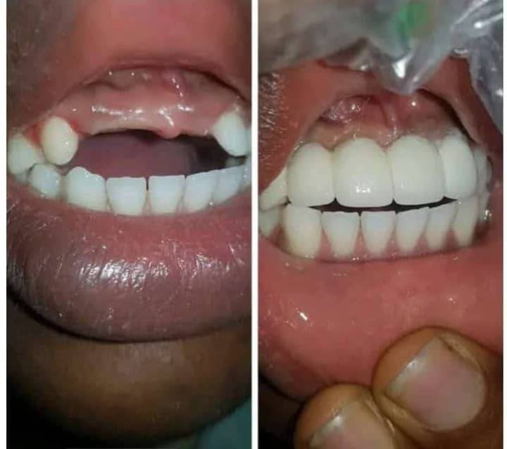
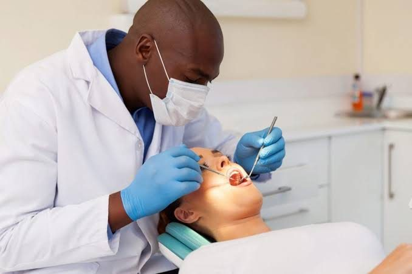
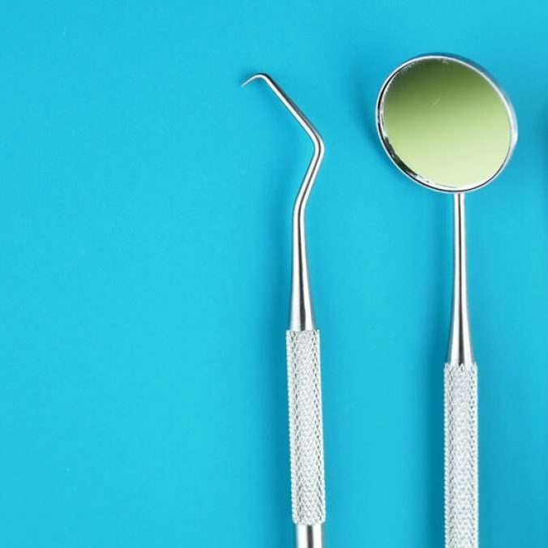
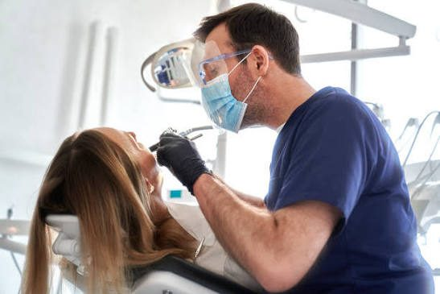
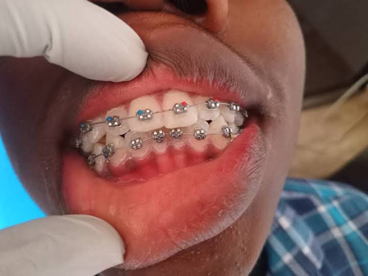
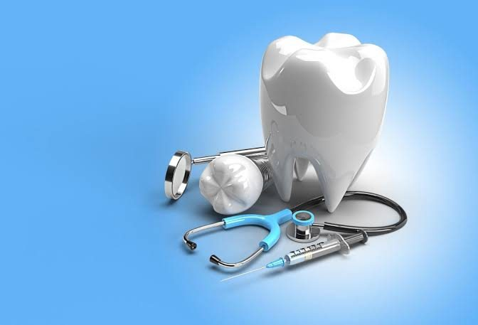
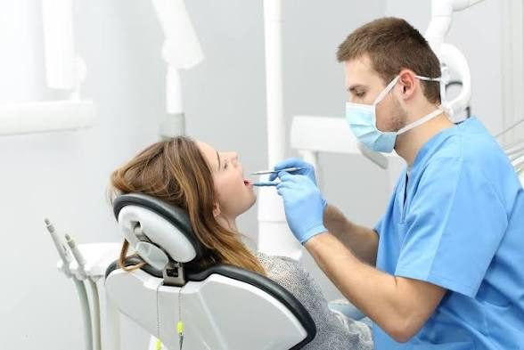
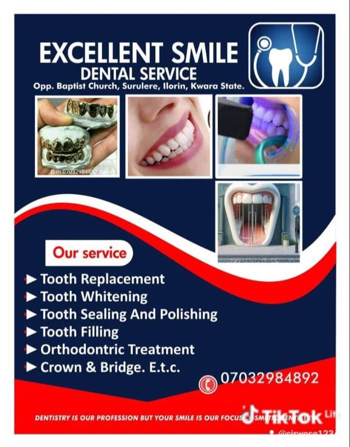
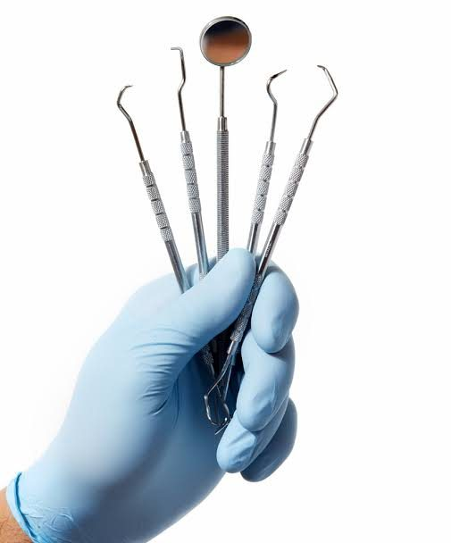

[Excellent SmileDental Services](./index.html)

- [Home](./index.html)
- [About](./about/index.html)
- [Services](./services/index.html)
- [Smile Makeover](./cosmetic-dentistry/index.html)
- [Gallery](./gallery/index.html)
- [Blog](./blog/index.html)
- [Contact](./contact/index.html)
- [Book Appointment](./appointment/index.html)

Dentist in Ilorin, Kwara State

# Dentistry is our profession, *your smile is our focus.*

Advanced, trusted dental care and lifelong dental wellness at Excellent Smile Dental Services. Our skilled team is here to give you exceptional care because your oral health matters to us.

[Book an Appointment](./appointment/index.html)[Explore Services](./services/index.html)[WhatsApp Us](https://wa.me/2347032984892?text=Hello%20Excellent%20Smile%20Dental%20Services%2C%20I%20would%20like%20to%20make%20an%20enquiry%2Fappointment.)

**★★★★★** 5.0 on Google · 15 reviews📍 Surulere Road, Ilorin🕘 Mon – Sat · 9AM – 5PM

**15**Google reviews

**5.0 ★**patient rating

**Mon–Sat**9:00 AM – 5:00 PM

Scroll

**5.0**Google rating

**15**Google reviews

**Ilorin**Surulere Road, Kwara

**Mon–Sat**9:00 AM – 5:00 PM

Tooth ReplacementTeeth WhiteningTooth Scaling & PolishingTooth FillingOrthodontic TreatmentCrown & BridgeDental Check-UpTooth ReplacementTeeth WhiteningTooth Scaling & PolishingTooth FillingOrthodontic TreatmentCrown & BridgeDental Check-UpTooth ReplacementTeeth WhiteningTooth Scaling & PolishingTooth FillingOrthodontic TreatmentCrown & BridgeDental Check-UpTooth ReplacementTeeth WhiteningTooth Scaling & PolishingTooth FillingOrthodontic TreatmentCrown & BridgeDental Check-Up

Welcome

## Your partner in oral health and lasting dental wellness

Excellent Smile Dental Services is a dental clinic on Surulere Road, opposite Baptist Church, Ilorin. We focus on healthy smiles, thoughtful patient care and professional dental services for the whole family.

Whether you need a routine check-up, a professional clean, a filling, braces, a crown or a bridge, or help replacing a missing tooth, our team explains each step clearly so you always know what is happening and why.

We believe good dental care is built on trust. That is why we listen first, explain your options in plain language, and treat every patient with kindness. As one of our patients wrote, they were “treated with kindness and a less painful process”.

- Oral health and dental wellness at the centre of everything we do
- Clear explanations and patient-friendly care
- A wide range of services in one clinic
- Easy booking by form, phone call or WhatsApp

[About the Clinic](./about/index.html)[The Clinic Experience](./clinic-experience/index.html)

**5.0★**Rated by our patients\
on Google

Why Choose Us

## Because your oral health matters to us

“Our skilled team is here to provide you with *exceptional care* because your oral health matters to us.”

💙

### Patient-focused care

Every visit begins with listening. We take your concerns seriously and explain every step.

🦷

### Complete dental services

From check-ups and cleaning to braces, crowns, bridges and tooth replacement, all in one place.

😊

### Smile-focused dentistry

Dentistry is our profession, but your smile is our focus. We care about how you feel as much as how your teeth look.

💬

### Easy to reach

Message us on WhatsApp or book online. We are open Monday to Saturday.

Our Dental Services

## Complete dental care for you and your family

Every service is explained in plain language. Choose a service to learn what it involves, what to expect and who it may suit.

🦷

### Tooth Replacement

Restore the look, comfort and function of your smile after a tooth has been lost.

- Helps you chew more comfortably and speak more clearly.
- Can restore a natural-looking smile and support your confidence.
- Helps to fill a gap so that neighbouring teeth are less likely to drift into it.

[Learn More →](./services/tooth-replacement/index.html)

✨

### Teeth Whitening

Professional whitening to brighten tooth shade and refresh your smile safely.

- Can noticeably lighten the shade of natural teeth.
- A relatively quick, non-invasive cosmetic treatment.
- Performed with professional supervision and protection for your gums.

[Learn More →](./services/teeth-whitening/index.html)

🪥

### Tooth Scaling & Polishing

A deep professional clean that removes plaque, tartar and surface stains.

- Removes hardened tartar that brushing at home cannot remove.
- Helps reduce the build-up of bacteria that can irritate the gums.
- Freshens breath by removing plaque and debris.

[Learn More →](./services/tooth-scaling-polishing/index.html)

🛡️

### Tooth Filling

Repair teeth damaged by decay or small fractures and restore their shape and strength.

- Stops decay from continuing to spread in that area of the tooth.
- Restores the shape of the tooth so that you can chew properly.
- Can relieve sensitivity or discomfort caused by a cavity.

[Learn More →](./services/tooth-filling/index.html)

😁

### Orthodontic Treatment

Straighten crooked or crowded teeth and improve the way your teeth bite together.

- Can straighten crowded or crooked teeth and close gaps.
- Can improve how the upper and lower teeth fit together.
- Straighter teeth are generally easier to brush and clean between.

[Learn More →](./services/orthodontic-treatment/index.html)

👑

### Crown & Bridge

Strengthen a damaged tooth with a crown, or close a gap with a bridge.

- A crown protects a weakened or heavily filled tooth from breaking.
- A bridge can fill a gap so that you can chew and smile more comfortably.
- Restorations can be matched to the colour and shape of your own teeth.

[Learn More →](./services/crown-and-bridge/index.html)

🔍

### Dental Check-Up

A regular examination to keep your teeth healthy and find problems early.

- Finds small problems early, when they are easier to treat.
- Helps prevent painful emergencies.
- Gives you personal advice about brushing, cleaning between teeth and diet.

[Learn More →](./services/dental-check-up/index.html)

[View All Services](./services/index.html)

Cosmetic Dentistry · Smile Makeover

## Create the smile you have always wanted

Cosmetic dentistry is about improving the look of your smile, while keeping your teeth healthy and comfortable.

A smile makeover brings together the treatments that suit you, such as whitening to brighten the shade, braces to straighten, crowns to restore a damaged tooth, and bridges or replacements to fill gaps. Your dentist will recommend what is suitable after examining your teeth.

[Explore Smile Makeover](./cosmetic-dentistry/index.html)

How It Works

## Your visit in four simple steps

1. **Book your visit.** Use the online form or message us on WhatsApp.
2. **Consultation & examination.** We listen to your concerns and carefully examine your teeth and gums.
3. **A clear plan.** We explain your options, the steps involved and what to expect, so you can decide.
4. **Treatment & aftercare.** We treat you gently and give you advice to keep your smile healthy at home.

Patient Reviews

## Loved by the patients we care for

**5.0**

★★★★★

15 Google reviews

**From the clinic:** “We appreciate your patronage! Our skilled team is here to provide you with exceptional care because your oral health matters to us.”

[Read Reviews](./reviews/index.html)[See us on Google](https://www.google.com/maps/search/?api=1&query=FGJP%2BMH%20Ilorin)

★★★★★

“The service I received was delightful despite the scary comments about how hard the process can be, but I was treated with kindness and a less painful process 👍👍👍”

I

**Ibrahim Nuseerah**\
Google review · 5 stars

★★★★★

“Excellent service rendered”

Z

**Zhikirullahi Olamilekan**\
Google review · 5 stars

From the Clinic

## Moments from Excellent Smile Dental Services

A look at our work, our care and our services.

[View Full Gallery](./gallery/index.html)

Dental Health Blog

## Learn how to care for your smile

Practical, easy-to-read guides from our dental education blog.

Prevention

### [Why Regular Dental Check-Ups Matter](./blog/why-regular-dental-check-ups-matter/index.html)

Many dental problems cause no pain at first. Here is why a routine visit is one of the best things you can do for your smile.

28 September 2026

[Read Article →](./blog/why-regular-dental-check-ups-matter/index.html)

Oral Hygiene

### [How to Maintain Good Oral Hygiene](./blog/how-to-maintain-good-oral-hygiene/index.html)

A simple daily routine, a few good habits and regular professional care are all you need for a healthy mouth.

24 September 2026

[Read Article →](./blog/how-to-maintain-good-oral-hygiene/index.html)

Patient Guide

### [What Happens During a Dental Check-Up?](./blog/what-happens-during-a-dental-check-up/index.html)

Never been, or been away for a long time? Here is a step-by-step guide to a routine dental visit.

20 September 2026

[Read Article →](./blog/what-happens-during-a-dental-check-up/index.html)

Cosmetic Dentistry

### [Teeth Whitening: What Patients Should Know](./blog/teeth-whitening-what-patients-should-know/index.html)

Thinking about a brighter smile? Learn how whitening works, what to expect and how to look after the result.

15 September 2026

[Read Article →](./blog/teeth-whitening-what-patients-should-know/index.html)

Oral Hygiene

### [Scaling and Polishing Explained](./blog/scaling-and-polishing-explained/index.html)

What is tartar, why can’t brushing remove it, and what happens during a professional clean?

10 September 2026

[Read Article →](./blog/scaling-and-polishing-explained/index.html)

Treatments

### [Understanding Dental Fillings](./blog/understanding-dental-fillings/index.html)

Why fillings are needed, how they are placed and how to look after a filled tooth.

5 September 2026

[Read Article →](./blog/understanding-dental-fillings/index.html)

[All Articles](./blog/index.html)

Frequently Asked Questions

## Answers to common questions

How do I book an appointment?

Use the appointment form on this website or message the clinic on WhatsApp (07032984892). Online requests are received as pending requests, and the clinic contacts you to confirm a date and time.

When is the clinic open?

The clinic is open Monday to Saturday, 9:00 AM – 5:00 PM.

Where is the clinic located?

Excellent Smile Dental Services is on Surulere Road, opposite Baptist Church, Ilorin, Kwara. The Google plus code is FGJP+MH Ilorin, and the Contact page has a map and a directions button.

Which dental services are offered?

Tooth replacement, teeth whitening, tooth scaling and polishing, tooth filling, orthodontic treatment, crown and bridge, and dental check-ups.

How often should I have a dental check-up?

Many people benefit from a check-up about every six months, but the right interval depends on your oral health. Your dentist can recommend a schedule that suits you.

Is teeth whitening suitable for everyone?

Not always. Whitening works on natural tooth enamel, so existing fillings, crowns and some types of staining respond differently. A short assessment helps your dentist advise whether whitening is a good option for you.

What is the difference between scaling and polishing?

Scaling removes plaque and hardened tartar from the teeth, including near the gum line. Polishing smooths the tooth surfaces afterwards, which makes it harder for new plaque and stains to cling.

Does a dental filling hurt?

Dentists aim to keep treatment as comfortable as possible, usually by numbing the area when needed. One patient wrote in a review that they were "treated with kindness and a less painful process". Tell your dentist if you feel any discomfort at any point.

[More Questions](./faq/index.html)

Find Us

## Visit Excellent Smile Dental Services

Surulere Road, opposite Baptist Church, Ilorin, Kwara · Plus code FGJP+MH Ilorin

📍

#### Address

Surulere Road, opposite Baptist Church, Ilorin, Kwara

💬

#### WhatsApp

[07032984892](https://wa.me/2347032984892?text=Hello%20Excellent%20Smile%20Dental%20Services%2C%20I%20would%20like%20to%20make%20an%20enquiry%2Fappointment.)

🕘

#### Opening hours

Monday – Saturday\
9:00 AM – 5:00 PM

[Get Directions](https://www.google.com/maps/dir/?api=1&destination=FGJP%2BMH%20Ilorin)[Book Appointment](./appointment/index.html)

📍

### Excellent Smile Dental Services

Surulere Road, opposite Baptist Church, Ilorin, Kwara\
Plus code: **FGJP+MH Ilorin**

[Open in Google Maps](https://www.google.com/maps/search/?api=1&query=FGJP%2BMH%20Ilorin)[Get Directions](https://www.google.com/maps/dir/?api=1&destination=FGJP%2BMH%20Ilorin)

## Ready for a healthier, brighter smile?

Book your visit with Excellent Smile Dental Services. Our skilled team is here to give you exceptional care.

[Book an Appointment](./appointment/index.html)[Chat on WhatsApp](https://wa.me/2347032984892?text=Hello%20Excellent%20Smile%20Dental%20Services%2C%20I%20would%20like%20to%20make%20an%20enquiry%2Fappointment.)

[Excellent SmileDental Services](./index.html)

Dentistry is our profession, but your smile is our focus.

Care for Your Smile, Care for You.

#### Explore

- [Home](./index.html)
- [About](./about/index.html)
- [Services](./services/index.html)
- [Smile Makeover](./cosmetic-dentistry/index.html)
- [Gallery](./gallery/index.html)
- [Blog](./blog/index.html)
- [Contact](./contact/index.html)
- [Reviews](./reviews/index.html)
- [FAQ](./faq/index.html)
- [Clinic Experience](./clinic-experience/index.html)

#### Services

- [Tooth Replacement](./services/tooth-replacement/index.html)
- [Teeth Whitening](./services/teeth-whitening/index.html)
- [Tooth Scaling & Polishing](./services/tooth-scaling-polishing/index.html)
- [Tooth Filling](./services/tooth-filling/index.html)
- [Orthodontic Treatment](./services/orthodontic-treatment/index.html)
- [Crown & Bridge](./services/crown-and-bridge/index.html)
- [Dental Check-Up](./services/dental-check-up/index.html)

#### Visit & Contact

- Surulere Road, opposite Baptist Church, Ilorin, Kwara
- Plus code: FGJP+MH Ilorin
- WhatsApp: [07032984892](https://wa.me/2347032984892?text=Hello%20Excellent%20Smile%20Dental%20Services%2C%20I%20would%20like%20to%20make%20an%20enquiry%2Fappointment.)
- Mon – Sat: 9:00 AM – 5:00 PM
- [Get directions →](https://www.google.com/maps/dir/?api=1&destination=FGJP%2BMH%20Ilorin)

© 2026 Excellent Smile Dental Services. All rights reserved.Rated 5.0 ★★★★★ on Google (15 reviews)